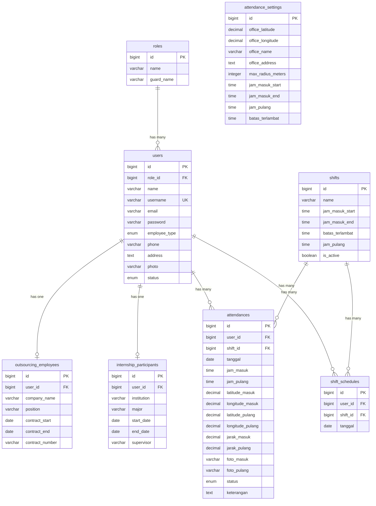

# 📋 Sistem Absensi PTUN Bandar Lampung

<p align="center">
  <strong>Sistem Informasi Absensi Pegawai Berbasis Web</strong><br>
  Pengadilan Tata Usaha Negara (PTUN) Bandar Lampung
</p>

<p align="center">
  
  
  
  
  
</p>

---

## 📖 Deskripsi

**Sistem Absensi PTUN** adalah aplikasi web untuk mengelola kehadiran pegawai di lingkungan Pengadilan Tata Usaha Negara (PTUN) Bandar Lampung. Aplikasi ini mendukung dua jenis pegawai yaitu **Outsourcing** dan **Magang (Internship)**, dengan fitur absensi berbasis **GPS & Geolocation** serta **foto selfie** sebagai bukti kehadiran.

Sistem ini memiliki dua panel utama:
- **Panel Admin** — untuk mengelola data pegawai, memantau kehadiran, mengelola jadwal shift, dan menghasilkan laporan.
- **Panel Pegawai** — untuk melakukan absensi harian (check-in & check-out) dan melihat riwayat kehadiran.

---

## ✨ Fitur Utama

### 🔐 Autentikasi & Otorisasi
- Login dengan **username** & password
- Role-based access control (Admin & Pegawai)
- Middleware proteksi route berdasarkan role
- Pengecekan status akun (akun `nonaktif` tidak dapat login)

### 👨‍💼 Panel Admin
- **Dashboard** — Ringkasan statistik kehadiran & data pegawai
- **Manajemen Pegawai Outsourcing** — CRUD lengkap (Create, Read, Update, Delete) dengan data kontrak
- **Manajemen Peserta Magang** — CRUD lengkap dengan data institusi & periode magang
- **Monitoring Kehadiran** — Lihat detail absensi seluruh pegawai
- **Manajemen Shift** — Kelola shift kerja (Pagi/Siang/Malam) untuk Satpam, atur jadwal shift per pegawai, dan penjadwalan massal (bulk schedule)
- **Laporan Absensi** — Filter berdasarkan periode & pegawai, dengan ringkasan statistik
- **Export Laporan** — Export ke format **PDF** dan **Excel (.xlsx)**
- **Import/Export Data Pegawai** — Import data pegawai dari file Excel, export ke Excel
- **Pengaturan Absensi** — Konfigurasi lokasi kantor, radius, jam kerja, dan batas keterlambatan

### 👤 Panel Pegawai
- **Dashboard** — Informasi kehadiran hari ini & statistik pribadi
- **Absensi Masuk (Check-in)** — Dengan validasi GPS, radius lokasi, dan foto selfie
- **Absensi Pulang (Check-out)** — Dengan validasi GPS, radius lokasi, dan foto selfie
- **Riwayat Kehadiran** — Histori absensi lengkap

### 🔄 Manajemen Shift
- Definisi multiple shift (contoh: Shift Pagi, Shift Siang, Shift Malam) dengan jam kerja masing-masing
- Penjadwalan shift per pegawai per hari
- **Bulk scheduling** — Atur jadwal shift untuk banyak pegawai sekaligus
- Aktivasi/deaktivasi shift
- Absensi otomatis menyesuaikan jam kerja berdasarkan shift yang dijadwalkan

### 📍 Fitur Geolocation
- Validasi lokasi menggunakan **rumus Haversine** (perhitungan jarak dua titik koordinat)
- Konfigurasi **radius maksimal** dari lokasi kantor (default: 50 meter)
- Penyimpanan koordinat latitude & longitude saat absensi
- Perhitungan jarak pegawai dari kantor secara real-time

### 📸 Foto Selfie
- Capture foto melalui kamera perangkat (base64 encoding)
- Penyimpanan foto terpisah untuk absensi masuk & pulang
- Format nama file: `{tipe}_{userId}_{timestamp}.png`

---

## 🛠️ Tech Stack

| Komponen        | Teknologi                                                    |
| --------------- | ------------------------------------------------------------ |
| **Framework**   | Laravel 10.x                                                 |
| **Bahasa**      | PHP 8.1+                                                     |
| **Database**    | MySQL                                                        |
| **Frontend**    | Blade Templates, Vite 5.x                                    |
| **PDF Export**  | [barryvdh/laravel-dompdf](https://github.com/barryvdh/laravel-dompdf) |
| **Excel I/O**   | [Maatwebsite Excel 3.x](https://laravel-excel.com/)          |
| **Auth Token**  | Laravel Sanctum                                              |
| **HTTP Client** | Guzzle                                                       |
| **Code Style**  | Laravel Pint                                                 |

---

## 📂 Struktur Proyek

```
sistem-absensi-ptun/
├── app/
│   ├── Console/                    # Artisan commands
│   ├── Exceptions/                 # Exception handlers
│   ├── Exports/                    # Export classes (Excel/PDF)
│   │   ├── AttendanceExport.php    #   Export data absensi
│   │   └── UserExport.php          #   Export data pegawai
│   ├── Http/
│   │   ├── Controllers/
│   │   │   ├── Admin/              # Controller panel admin
│   │   │   │   ├── AttendanceController.php
│   │   │   │   ├── DashboardController.php
│   │   │   │   ├── InternshipController.php
│   │   │   │   ├── OutsourcingController.php
│   │   │   │   ├── ReportController.php
│   │   │   │   ├── SettingController.php
│   │   │   │   └── ShiftController.php
│   │   │   ├── Employee/           # Controller panel pegawai
│   │   │   │   ├── AttendanceController.php
│   │   │   │   ├── DashboardController.php
│   │   │   │   └── HistoryController.php
│   │   │   └── Auth/               # Controller autentikasi
│   │   │       └── LoginController.php
│   │   └── Middleware/
│   │       └── RoleMiddleware.php   # Middleware cek role
│   ├── Imports/                    # Import classes (Excel)
│   │   └── UserImport.php          #   Import data pegawai
│   ├── Models/                     # Eloquent models
│   │   ├── Attendance.php
│   │   ├── AttendanceSetting.php
│   │   ├── InternshipParticipant.php
│   │   ├── OutsourcingEmployee.php
│   │   ├── Role.php
│   │   ├── Shift.php
│   │   ├── ShiftSchedule.php
│   │   └── User.php
│   └── Providers/
├── database/
│   ├── migrations/                 # Migrasi database
│   └── seeders/                    # Data awal
│       ├── DatabaseSeeder.php
│       ├── RoleSeeder.php
│       ├── AttendanceSettingSeeder.php
│       └── AdminSeeder.php
├── resources/
│   └── views/
│       ├── admin/                  # View panel admin
│       │   ├── attendance/         #   Monitoring kehadiran
│       │   ├── dashboard.blade.php #   Dashboard admin
│       │   ├── internship/         #   CRUD peserta magang
│       │   ├── outsourcing/        #   CRUD pegawai outsourcing
│       │   ├── reports/            #   Laporan absensi
│       │   ├── settings/           #   Pengaturan absensi
│       │   └── shifts/             #   Manajemen shift
│       ├── employee/               # View panel pegawai
│       │   ├── attendance/         #   Halaman absensi
│       │   ├── dashboard.blade.php #   Dashboard pegawai
│       │   └── history/            #   Riwayat kehadiran
│       ├── auth/                   # View halaman login
│       └── layouts/                # Layout template
├── routes/
│   └── web.php                     # Definisi route
├── public/                         # Asset publik
└── storage/                        # File upload & cache
```

---

## 🗄️ Skema Database

### Entity Relationship Diagram (ERD)



### Detail Tabel

#### Tabel `users`
| Kolom           | Tipe                       | Keterangan                    |
| --------------- | -------------------------- | ----------------------------- |
| id              | bigint (PK)                | Primary key                   |
| role_id         | bigint (FK → roles)        | Relasi ke tabel roles         |
| name            | varchar                    | Nama lengkap                  |
| username        | varchar (unique)           | Username untuk login          |
| email           | varchar (nullable)         | Email (opsional)              |
| password        | varchar                    | Password (hashed)             |
| employee_type   | enum: outsourcing, magang  | Jenis pegawai (nullable)      |
| phone           | varchar(20)                | Nomor telepon                 |
| address         | text                       | Alamat                        |
| photo           | varchar                    | Path foto profil              |
| status          | enum: aktif, nonaktif      | Status akun                   |

#### Tabel `roles`
| Kolom      | Tipe        | Keterangan   |
| ---------- | ----------- | ------------ |
| id         | bigint (PK) | Primary key  |
| name       | varchar     | Nama role    |
| guard_name | varchar     | Guard name   |

#### Tabel `attendances`
| Kolom            | Tipe                                        | Keterangan                         |
| ---------------- | ------------------------------------------- | ---------------------------------- |
| id               | bigint (PK)                                 | Primary key                        |
| user_id          | bigint (FK → users)                         | Relasi ke user                     |
| shift_id         | bigint (FK → shifts, nullable)              | Relasi ke shift (jika ada)         |
| tanggal          | date                                        | Tanggal absensi                    |
| jam_masuk        | time                                        | Waktu check-in                     |
| jam_pulang       | time                                        | Waktu check-out                    |
| latitude_masuk   | decimal(10,7)                               | Latitude saat masuk                |
| longitude_masuk  | decimal(10,7)                               | Longitude saat masuk               |
| latitude_pulang  | decimal(10,7)                               | Latitude saat pulang               |
| longitude_pulang | decimal(10,7)                               | Longitude saat pulang              |
| jarak_masuk      | decimal(10,2)                               | Jarak dari kantor saat masuk (m)   |
| jarak_pulang     | decimal(10,2)                               | Jarak dari kantor saat pulang (m)  |
| foto_masuk       | varchar                                     | Nama file foto check-in            |
| foto_pulang      | varchar                                     | Nama file foto check-out           |
| status           | enum: hadir, terlambat, izin, sakit, alfa   | Status kehadiran                   |
| keterangan       | text                                        | Catatan tambahan                   |

> **Constraint**: Kombinasi `user_id` + `tanggal` bersifat **unique** (satu user hanya bisa absen satu kali per hari).

#### Tabel `shifts`
| Kolom            | Tipe          | Keterangan                                   |
| ---------------- | ------------- | -------------------------------------------- |
| id               | bigint (PK)   | Primary key                                  |
| name             | varchar       | Nama shift (misal: Shift Pagi, Shift Malam)  |
| jam_masuk_start  | time          | Jam mulai boleh absen masuk                  |
| jam_masuk_end    | time          | Jam akhir boleh absen masuk                  |
| batas_terlambat  | time          | Batas jam dianggap terlambat                 |
| jam_pulang       | time          | Jam pulang                                   |
| is_active        | boolean       | Status aktif shift (default: true)           |

#### Tabel `shift_schedules`
| Kolom    | Tipe                 | Keterangan                           |
| -------- | -------------------- | ------------------------------------ |
| id       | bigint (PK)          | Primary key                          |
| user_id  | bigint (FK → users)  | Relasi ke pegawai                    |
| shift_id | bigint (FK → shifts) | Relasi ke shift                      |
| tanggal  | date                 | Tanggal berlakunya jadwal shift      |

> **Constraint**: Kombinasi `user_id` + `tanggal` bersifat **unique** (satu pegawai hanya bisa memiliki satu shift per hari).

#### Tabel `attendance_settings`
| Kolom              | Tipe          | Keterangan                        |
| ------------------ | ------------- | --------------------------------- |
| id                 | bigint (PK)   | Primary key                       |
| office_latitude    | decimal(10,7) | Latitude lokasi kantor            |
| office_longitude   | decimal(10,7) | Longitude lokasi kantor           |
| office_name        | varchar       | Nama kantor                       |
| office_address     | text          | Alamat kantor                     |
| max_radius_meters  | integer       | Radius maksimal absensi (meter)   |
| jam_masuk_start    | time          | Jam mulai absensi masuk           |
| jam_masuk_end      | time          | Jam akhir absensi masuk           |
| jam_pulang         | time          | Jam pulang                        |
| batas_terlambat    | time          | Batas waktu sebelum dianggap terlambat |

#### Tabel `outsourcing_employees`
| Kolom           | Tipe                | Keterangan               |
| --------------- | ------------------- | ------------------------ |
| id              | bigint (PK)         | Primary key              |
| user_id         | bigint (FK → users) | Relasi ke user           |
| company_name    | varchar             | Nama perusahaan          |
| position        | varchar             | Jabatan/posisi           |
| contract_start  | date                | Tanggal mulai kontrak    |
| contract_end    | date                | Tanggal akhir kontrak    |
| contract_number | varchar             | Nomor kontrak            |

#### Tabel `internship_participants`
| Kolom      | Tipe                | Keterangan            |
| ---------- | ------------------- | --------------------- |
| id         | bigint (PK)         | Primary key           |
| user_id    | bigint (FK → users) | Relasi ke user        |
| institution| varchar             | Institusi asal        |
| major      | varchar             | Jurusan/program studi |
| start_date | date                | Tanggal mulai magang  |
| end_date   | date                | Tanggal akhir magang  |
| supervisor | varchar             | Nama pembimbing       |

---

## ⚙️ Persyaratan Sistem

- **PHP** >= 8.1
- **Composer** >= 2.x
- **MySQL** >= 5.7 / MariaDB >= 10.3
- **Node.js** >= 18.x & **NPM** >= 9.x
- **Web Server**: Apache / Nginx (atau gunakan Laragon / XAMPP)
- **Ekstensi PHP**: BCMath, Ctype, Fileinfo, JSON, Mbstring, OpenSSL, PDO, Tokenizer, XML, GD/Imagick

---

## 🚀 Instalasi

### 1. Clone Repository

```bash
git clone https://github.com/randipkur09/sistem-absensi-ptun.git
cd sistem-absensi-ptun
```

### 2. Install Dependensi PHP

```bash
composer install
```

### 3. Install Dependensi Frontend

```bash
npm install
```

### 4. Konfigurasi Environment

```bash
cp .env.example .env
php artisan key:generate
```

Edit file `.env` dan sesuaikan konfigurasi database:

```env
APP_NAME="Sistem Absensi PTUN"
APP_URL=http://localhost/sistem-absensi-ptun/public

DB_CONNECTION=mysql
DB_HOST=127.0.0.1
DB_PORT=3306
DB_DATABASE=sistem_absensi_ptun
DB_USERNAME=root
DB_PASSWORD=
```

### 5. Buat Database

Buat database MySQL dengan nama sesuai konfigurasi `.env`:

```sql
CREATE DATABASE sistem_absensi_ptun;
```

### 6. Jalankan Migrasi & Seeder

```bash
php artisan migrate --seed
```

Seeder akan membuat:
- **2 Role**: `admin` dan `pegawai`
- **1 Akun Admin** default
- **1 Pengaturan Absensi** default (lokasi PTUN Bandar Lampung)

### 7. Buat Storage Link

```bash
php artisan storage:link
```

### 8. Build Asset Frontend

```bash
# Development (dengan hot reload)
npm run dev

# Production
npm run build
```

### 9. Jalankan Server

```bash
php artisan serve
```

Atau jika menggunakan Laragon, akses langsung melalui:
```
http://sistem-absensi-ptun.test
```

---

## 🔑 Akun Default

| Role      | Username  | Email                              | Password      |
| --------- | --------- | ---------------------------------- | ------------- |
| **Admin** | `admin`   | `admin@ptun-bandarlampung.go.id`   | `password123` |

> ⚠️ **Penting**: Segera ganti password default setelah instalasi pertama!

---

## 📋 Panduan Penggunaan

### Sebagai Admin

1. **Login** dengan username & password admin
2. **Dashboard** — Lihat ringkasan kehadiran & statistik
3. **Kelola Outsourcing** — Tambah/edit/hapus data pegawai outsourcing
4. **Kelola Magang** — Tambah/edit/hapus data peserta magang
5. **Monitor Kehadiran** — Pantau absensi seluruh pegawai secara real-time
6. **Kelola Shift** — Buat shift kerja, atur jadwal shift pegawai (khusus Satpam)
7. **Laporan** — Filter, lihat, dan export laporan ke PDF/Excel
8. **Pengaturan** — Konfigurasi lokasi kantor, radius, dan jam kerja
9. **Import/Export** — Import data pegawai dari Excel atau export ke Excel

### Sebagai Pegawai

1. **Login** dengan username & password pegawai
2. **Dashboard** — Lihat status kehadiran hari ini
3. **Absensi Masuk** — Izinkan akses kamera & lokasi, ambil foto selfie, lalu submit
4. **Absensi Pulang** — Sama seperti absensi masuk, dilakukan saat jam pulang
5. **Riwayat** — Lihat histori kehadiran lengkap

---

## 🔒 Pengaturan Absensi Default

| Parameter          | Nilai Default                   |
| ------------------ | ------------------------------- |
| Nama Kantor        | PTUN Bandar Lampung             |
| Alamat             | Jl. Pangeran Emir M. Noer No.73, Durian Payung, Kec. Tanjung Karang Pusat |
| Latitude           | -5.4245573                      |
| Longitude          | 105.2437446                     |
| Radius Maksimal    | 50 meter                        |
| Jam Masuk (mulai)  | 08:00                           |
| Jam Masuk (akhir)  | 08:15                           |
| Jam Pulang         | 16:00                           |
| Batas Terlambat    | 08:15                           |

> Semua parameter di atas dapat diubah melalui menu **Pengaturan** di panel Admin.

---

## 🗺️ Alur Absensi

```
┌─────────────┐     ┌──────────────┐     ┌──────────────┐     ┌───────────────┐
│  Pegawai     │────▶│  Buka Halaman│────▶│  Izinkan     │────▶│  Ambil Foto   │
│  Login       │     │  Absensi     │     │  GPS & Kamera│     │  Selfie       │
└─────────────┘     └──────────────┘     └──────────────┘     └───────┬───────┘
                                                                       │
                                                                       ▼
┌─────────────┐     ┌──────────────┐     ┌──────────────┐     ┌───────────────┐
│  Absensi    │◀────│  Tentukan    │◀────│  Validasi    │◀────│  Submit       │
│  Tercatat   │     │  Status      │     │  Radius      │     │  Absensi      │
│  ✅         │     │  Hadir/Telat │     │  (≤ 50m)     │     │               │
└─────────────┘     └──────────────┘     └──────────────┘     └───────────────┘
```

### Alur Absensi dengan Shift (Satpam)

```
┌─────────────┐     ┌──────────────┐     ┌──────────────┐     ┌───────────────┐
│  Admin      │────▶│  Buat Shift  │────▶│  Atur Jadwal │────▶│  Pegawai      │
│  Setup      │     │  (Pagi/Malam)│     │  per Tanggal │     │  Terjadwal    │
└─────────────┘     └──────────────┘     └──────────────┘     └───────┬───────┘
                                                                       │
                                                                       ▼
                                                               ┌───────────────┐
                                                               │  Absensi      │
                                                               │  Sesuai Jam   │
                                                               │  Shift        │
                                                               └───────────────┘
```

---

## 🧪 Menjalankan Tests

```bash
php artisan test
```

Atau menggunakan PHPUnit secara langsung:

```bash
./vendor/bin/phpunit
```

---

## 📝 Catatan Pengembangan

- **Foto absensi** disimpan di `storage/app/public/attendance-photos/`
- **Foto profil** disimpan di `storage/app/public/`
- Pastikan direktori `storage` memiliki permission yang sesuai
- Gunakan `php artisan storage:link` untuk membuat symbolic link ke `public/storage`
- Aplikasi menggunakan **Vite** sebagai build tool untuk asset frontend
- Login menggunakan **username** (bukan email)
- Fitur **Manajemen Shift** ditujukan khusus untuk pegawai dengan posisi **Satpam**
- Tabel `permissions` (perizinan) telah dihapus dari sistem pada versi terbaru

---

## 📄 Lisensi

Proyek ini dikembangkan untuk keperluan internal **Pengadilan Tata Usaha Negara (PTUN) Bandar Lampung**.

---

<p align="center">
  Dibuat dengan ❤️ untuk PTUN Bandar Lampung
</p>
